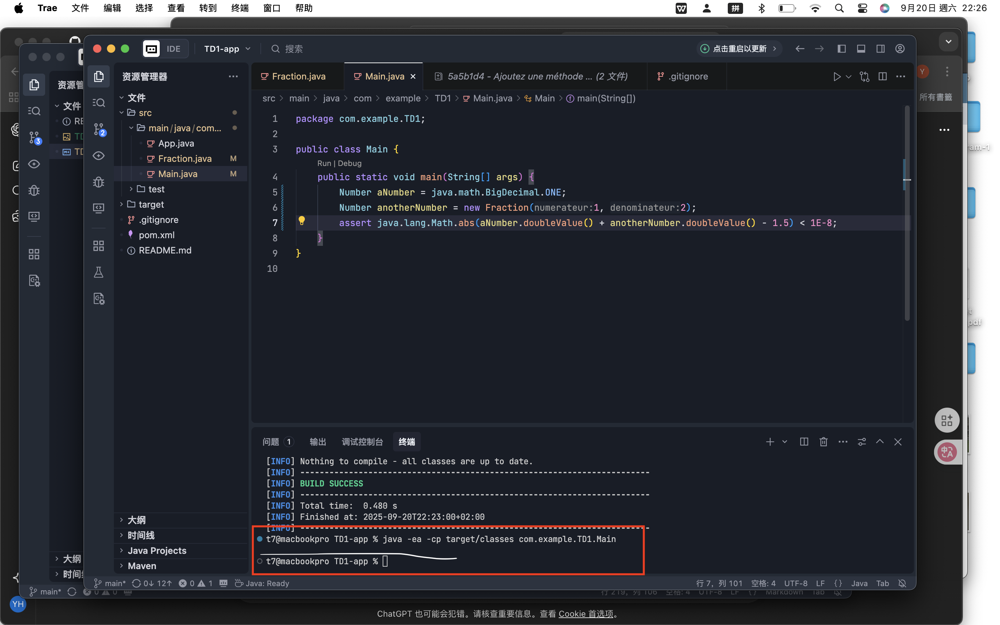

# Compléments de programmation - TD 1
Nom, Prénom, No Etudiant, Nc
     > HUANG, YANMO, 22502235, 30
## Remarques préliminaires
* Pour l'ensemble des TDs, vous créerez un compte individuel sur [github](https://github.com/) si vous n'en possédez pas déjà un.
Vous nommerez ce compte de la façon suivante: `uvsq<MonNuméroÉtudiant>`.
Par exemple, pour un étudiant de numéro *21601234*, le compte sera `uvsq21601234`.
* Les commandes `git` sont à taper en ligne de commande dans un *shell*.
* Vous pouvez utiliser l'IDE de votre choix.
Sur le cartable numérique, [Eclipse](www.eclipse.org), [IntelliJ IDEA](http://www.jetbrains.com/idea/) et [Visual Studio Code](https://code.visualstudio.com/) sont installés.
* Vous répondrez aux questions directement dans ce fichier en complétant les emplacements correspondants.
Ajoutez ensuite ce fichier au dépôt `git`.

## Partie I (à faire durant le TD) : découverte de `git`
Dans cet exercice, vous créerez une classe `Fraction` représentant un nombre rationnel et une classe `Main` qui testera les méthodes de la classe `Fraction` **avec des assertions** (cf. [Utilisation d'assertions](https://koor.fr/Java/Tutorial/java_assert.wp)).
À chaque étape, consultez le statut des fichiers du projet (`git status`) ainsi que l'historique (`git log`).

1. Sur la forge, créez le dépôt (_repository_) `SimpleFraction`;
En terme de *commits*, quelle différence constatez-vous entre cocher une (ou plusieurs) des cases *Initialize this repository with* et n'en cocher aucune ?
    > 
    Dans la gitHub,si on n'en cocher aucune, il va créer un dépôt vide sans fichier, comme le montre l'image ci-dessus.
    Si on cocher les cases, il va créer un dépôt avec un fichier `README.md`, un fichier `.gitignore`, un fichier `LICENSE`.

    *Pour la suite, ne cochez aucune de ces cases*.
1. Localement, configurez `git` avec votre nom (`user.name`) et votre email (`user.email`) (cf. [Personnalisation de Git](https://git-scm.com/book/fr/v2/Personnalisation-de-Git-Configuration-de-Git));
    ```bash
    # Commandes pour configurer git
    git config --global user.name "uvsq22502235"
    git config --global user.email "yanmohuang3@gmail.com"
    ```
1. Initialisez le dépôt `git` local pour le projet (cf. [Démarrer un dépôt Git](https://git-scm.com/book/fr/v2/Les-bases-de-Git-D%C3%A9marrer-un-d%C3%A9p%C3%B4t-Git));
    ```bash
    # Commandes pour initialiser le dépôt git
    git init
    ```
1. Dans votre IDE, créez la classe `Fraction` (vide pour le moment) et la classe `Main` (avec un simple affichage) dans le projet (cf. [Méthode `main`](https://docs.oracle.com/javase/specs/jls/se19/html/jls-12.html#jls-12.1.4));
Vérifiez que le projet compile et s'exécute dans l'IDE;
Validez les changements (cf. [Enregistrer des modifications dans le dépôt](https://git-scm.com/book/fr/v2/Les-bases-de-Git-Enregistrer-des-modifications-dans-le-d%C3%A9p%C3%B4t));
    ```bash
    # Commandes pour valider les changements
    git add .
    git commit -m "Créer Fraction and Main class et s'exécuter bien"
    ```
1. Ajoutez la méthode `toString` à la classe `Fraction` (cf. [`Object.toString`](https://docs.oracle.com/en/java/javase/19/docs/api/java.base/java/lang/Object.html#toString())) qui retournera la chaîne `"Je suis une fraction."` et modifiez la classe `Main` en conséquence;
Validez les changements;
    ```Java
    // Code pour tester toString
    public static void main(String[] args) {
        Fraction f = new Fraction();
        System.out.println(f.toString());
    }
    ```
1. Publiez vos modifications sur le dépôt distant (cf. [Travailler avec des dépôts distants](https://git-scm.com/book/fr/v2/Les-bases-de-Git-Travailler-avec-des-d%C3%A9p%C3%B4ts-distants));
Vous utiliserez le protocole `https` pour cela;
Vérifiez avec le navigateur;
    ```bash
    # Commandes pour publier les modifications
    git remote add sf https://github.com/uvsq22502235/SimpleFraction.git
    git remote -v # Vérifier si le dépôt distant est bien ajouté
    git push sf main
    ```
1. Sur la forge, ajoutez un fichier de documentation `README.md`.
Quelle syntaxe est utilisée pour ce fichier ?
    > Markdown
1. Récupérez localement les modifications effectuées sur la forge.
    ```bash
    # Commandes pour récupérer les modifications
    git fetch sf 

    # Commandes pour mettre à jour le dépôt local
    git pull sf main
    ```
1. Ajoutez les répertoires et fichiers issus de la compilation aux fichiers ignorés par `git` (cf. [`.gitignore` pour Java](https://github.com/github/gitignore/blob/main/Java.gitignore));
    ```bash
    # Copier ici le contenu de `.gitignore`

    # Compiled class file
    *.class

    # Log file
    *.log

    # BlueJ files
    *.ctxt

    # Mobile Tools for Java (J2ME)
    .mtj.tmp/

    # Package Files #
    *.jar
    *.war
    *.nar
    *.ear
    *.zip
    *.tar.gz
    *.rar

    # virtual machine crash logs, see http://www.java.com/en/download/help/error_hotspot.xml
    hs_err_pid*
    replay_pid*

    # Maven build output
    target/
    ```
1. Retirez les fichiers de configuration de l'IDE du projet;
    ```bash
    # Commandes pour retirer les fichiers de configuration de l'IDE
    git rm -r --cached .vscode
    ```
    Ajoutez-les aux fichiers ignorés par `git`.
    ```bash
    # Copier ici les modifications de `.gitignore`

    # Ajouter les fichiers de configuration de l'IDE dans `.gitignore`

    # IDE files
    .vscode/
    .idea/ #pour IntelliJ IDEA
    *.iml 
    .classpath # pour Eclipse
    .project
    .settings/
    ```
1. Configurez l'accès par clé publique/clé privée à la forge (cf. [Connecting to GitHub with SSH](https://docs.github.com/en/authentication/connecting-to-github-with-ssh)).
    > Tout d’abord, on crée une clé SSH avec ssh-keygen, puis on copie la clé publique (.pub) dans les SSH keys de GitHub, et enfin on teste la connexion avec ssh -T git@github.com.

## Partie II (à faire durant le TD) : compléter la classe `Fraction`
Dans cet partie, vous compléterez les classes `Fraction` et `Main`.
Un exemple d'interface pour une telle classe est donné par la classe [`Fraction`](http://commons.apache.org/proper/commons-math/javadocs/api-3.6.1/org/apache/commons/math3/fraction/Fraction.html) de la bibliothèque [Apache Commons Math](http://commons.apache.org/math/).

Vous respecterez les consignes ci-dessous :
* chaque méthode de `Fraction` sera testée dans `Main` **avec des assertions** (cf. [Utilisation d'assertions](https://koor.fr/Java/Tutorial/java_assert.wp));
* à la fin de chaque question, consultez le statut des fichiers du projet (`git status`) ainsi que l'historique (`git log`) puis validez les changements.

1. Ajoutez les attributs représentants le numérateur et le dénominateur (nombres entiers).
    ```Java
    // Déclaration des attributs
    private int numerateur;
    private int denominateur;
    ```
1. Ajoutez les constructeurs (cf. [Constructor Declarations](https://docs.oracle.com/javase/specs/jls/se19/html/jls-8.html#jls-8.8)) suivants :
    * initialisation avec un numérateur et un dénominateur,
    * initialisation avec juste le numérateur (dénominateur égal à _1_),
    * initialisation sans argument (numérateur égal _0_ et dénominateur égal à _1_),
    ```Java
    @Override
    public String toString() {
        return numerateur + "/" + denominateur;
    }
    // Assertions pour tester les constructeurs (avec toString)
    Fraction f1 = new Fraction(3,4);
    assert f1.toString().equals("3/4");
    Fraction f2 = new Fraction(3);
    assert f2.toString().equals("3/1");
    Fraction f3 = new Fraction();
    assert f3.toString().equals("0/1");
    System.out.println("Tout les constructeurs marchent bien! ");
    ```
1. Ajoutez les fractions constantes ZERO (0, 1) et UN (1, 1) (cf. [Constants in Java](https://www.baeldung.com/java-constants-good-practices)),
    ```Java
    // Déclaration des constantes
    public static final Fraction ZERO = new Fraction(0, 1);
    public static final Fraction UN = new Fraction(1, 1);
    ```
1. Ajoutez une méthode de consultation du numérateur et du dénominateur (par convention, en Java, une méthode retournant la valeur de l'attribut `anAttribute` est nommée `getAnAttribute`),
    ```Java
    // Définition des getters
    public int getNumerateur() {
        return numerateur;
    }

    public int getDenominateur() {
        return denominateur;
    }
    ```
1. Ajoutez une méthode de consultation de la valeur sous la forme d'un nombre en virgule flottante (méthode `doubleValue()`) (cf. [`java.lang.Number`](https://docs.oracle.com/en/java/javase/19/docs/api/java.base/java/lang/Number.html)),
   ```Java
    // Assertions pour tester la conversion
    Fraction f1 = new Fraction(3,4);
    assert f1.doubleValue() == 0.75;
    System.out.println("doubleValue() marchent bien! ");
    ```
1. Ajoutez une méthode permettant l'addition de deux fractions (la méthode `add` prend en paramètre *une* fraction et *retourne* la somme de la fraction courante et du paramètre),
   ```Java
    // Assertions pour tester l'addition
    Fraction f1 = new Fraction(2,4);
    Fraction f2 = new Fraction(1,4);
    Fraction f3 = f1.add(f2);
    assert f3.doubleValue()==0.75;
    System.out.println("add() marchent bien! ");
    ```
1. Ajoutez le test d'égalité entre fractions (deux fractions sont égales si elles représentent la même fraction réduite) (cf. [`java.lang.Object.equals`](https://docs.oracle.com/en/java/javase/19/docs/api/java.base/java/lang/Object.html#equals(java.lang.Object))),
   ```Java
    // Assertions pour tester l'égalité
    Fraction f1 = new Fraction(1, 2);
    Fraction f2 = new Fraction(2, 4);
    Fraction f3 = new Fraction(3, 4);
    assert f1.equals(f2);       
    assert !f1.equals(f3);    
    System.out.println("equals() marche bien !");
    ```
1. Ajoutez la comparaison de fractions selon l'ordre naturel (cf. [`java.lang.Comparable`](https://docs.oracle.com/en/java/javase/19/docs/api/java.base/java/lang/Comparable.html)).
   ```Java
    // Assertions pour tester la comparaison
    Fraction f1 = new Fraction(1, 2);
    Fraction f2 = new Fraction(2, 4);
    Fraction f3 = new Fraction(3, 4);
    assert f1.compareTo(f2) == 0;   
    assert f1.compareTo(f3) < 0;    
    assert f3.compareTo(f1) > 0;    
    System.out.println("compareTo() marche bien !");
    ```
1. Faites hériter votre classe `Fraction` de la classe [`java.lang.Number`](https://docs.oracle.com/en/java/javase/19/docs/api/java.base/java/lang/Number.html) et complétez les méthodes
   ```Java
    // Vérifiez avec le code ci-dessous
    Number aNumber = java.math.BigDecimal.ONE;
    Number anotherNumber = new Fraction(1, 2);
    assert java.lang.Math.abs(aNumber.doubleValue() + anotherNumber.doubleValue() - 1.5) < 1E-8;
    // L’assertion est vérifiée. Comme le test ne produit aucune sortie, cela signifie qu’elle est vraie.
    ```
    

## Partie III (à faire à la maison) : révisions et perfectionnement *shell* et *IDE*
### Maîtriser le *shell* de commandes
L'objectif de cet exercice est de vous faire réviser/découvrir les commandes de base du *shell* de votre machine.
Vous pouvez répondre en utilisant le shell de votre choix (*bash*, *Powershell*, …).
Pour répondre à ces questions, vous devez effectuer les recherches documentaires adéquates (livre, web, …).

1. Quel OS et quel shell de commande utilisez-vous ?
    > macOS avec zsh
1. Quelle commande permet d'obtenir de l'aide ?
Donnez un exemple.
    ```bash
    # man help
    man ls # afficher l'aide de la commande ls
    ```
1. Donnez la ou les commandes shell permettant de
    1. afficher les fichiers d'un répertoire triés par taille (taille affichée lisiblement)
        ```bash
        ls -lhS
        ```
    1. compter le nombre de ligne d'un fichier
        ```bash
        wc -l fichier
        ```
    1. afficher les lignes du fichier `Main.java` contenant la chaîne `uneVariable`
        ```bash
        grep "uneVariable" Main.java
        ```
    1. afficher récursivement les fichiers `.java` contenant la chaîne `uneVariable`
        ```bash
        grep -r "uneVariable" --include="*.java"  src/
        ```
    1. trouver les fichiers (pas les répertoires) nommés `README.md` dans une arborescence de répertoires
        ```bash
        find . -name "README.md"
        ```
    1. afficher les différences entre deux fichiers textes
        ```bash
        diff fichier1 fichier2
        ```
1. Expliquez en une ou deux phrases le rôle de ces commandes et dans quel contexte elles peuvent être utiles pour un développeur.
    * `ssh`
        > Pour se connecter à distance à un autre ordinateur, par exemple pour accéder à un serveur distant.
    * `screen`/`tmux`
        > Ils permettent de garder un terminal actif. Même si on ferme la fenêtre, le programme continue, et on peut revenir plus tard dans la session.
    * `curl`/[HTTPie](https://httpie.org/)
        > Pour effectuer des requêtes HTTP et tester les APIs.
    * [jq](https://stedolan.github.io/jq/)
        > Pour traiter et interroger des données JSON. Il fonctionne un peu comme `sed`, `awk` ou `grep` pour les textes.

### Découverte de votre *IDE*
Dans cet exercice, vous expliquerez en quelques phrases comment vous réalisez les actions ci-dessous dans votre IDE.
Vous pouvez choisir l'IDE/éditeur de texte de votre choix.
Pour réaliser cette exercice, vous devez bien évidemment vous reporter à la documentations de l'IDE ([IntelliJ IDEA](https://www.jetbrains.com/help/idea/discover-intellij-idea.html#developer-tools), [Visual Studio Code](https://code.visualstudio.com/docs), [Eclipse](https://help.eclipse.org/2020-09/index.jsp), …).

1. Quels IDE ou éditeurs de texte utilisez-vous pour le développement Java ?
    > Trae(comme VsCode)

    Pour la suite, ne considérez que l'un de vos choix.
1. Comment vérifier/définir que l'encodage utilisé est *UTF-8* ?
    > En bas de droit de la fenêtre, il y a l'encodage actuel. Il faut qu'il soit *UTF-8*.
1. Comment choisir le JDK à utiliser dans un projet ?
    > Avec l’extension Java, on ouvre la palette de commandes (Command+Shift+P sur Mac) et on choisit Java: Configure Java Runtime.
1. Comment préciser la version Java des sources dans un projet ?
    > On peut le mettre dans settings.json ou dans pom.xml (Maven).
1. Comment ajouter une bibliothèque externe dans un projet ?
    > Avec Maven, on ajoute la dépendance dans pom.xml. Maven gère les JAR tout seul. Sinon, on peut mettre le JAR dans le dossier lib.
1. Comment reformater un fichier source Java ?
    > `Option + Shift + F` sur Mac.
1. Comment trouver la déclaration d'une variable ou méthode ?
    > On place le curseur sur le nom et on appuie sur `command + clik`.
1. Comment insérer un bloc de code prédéfini (*snippet*) ?
    > On tape le mot clé du snippet et on appuie sur Tab.
1. Comment renommer une classe dans l'ensemble du projet ?
    > On peut sélectionner le nom de la classe, faire un clic droit et choisir Rename Symbol, puis entrer le nouveau nom.
1. Comment exécuter le programme en lui passant un paramètre en ligne de commande ?
    > Créer une configuration launch.json et ajouter le paramètre("args": ["param1", "param2"]).
1. Comment déboguer le programme en visualisant le contenu d'une ou plusieurs variables ?
    > On met un point d’arrêt, puis on clique sur le bouton Debug pour lancer le programme. Ensuite, on regarde les variables dans le panneau Debug.
1. Quels paramètres ou fonctionnalités vous semblent particulièrement importants/utiles pour le développement Java ?
    > Les plus utiles sont : l’auto-complétion, le débogage, Maven/Gradle, Git, le formatage et les snippets.
